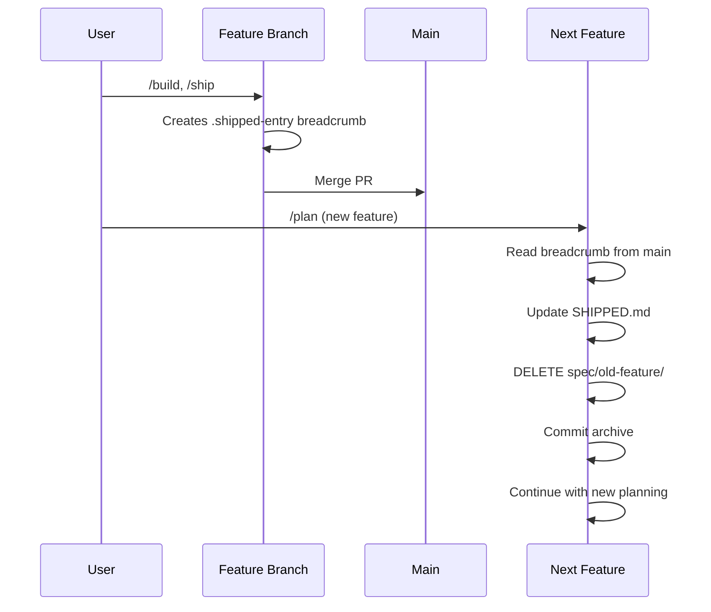

# Implementation Plan: Script Library Phase 2 - Extract Command Logic
Generated: 2025-10-14
Specification: spec.md

## Understanding

This is Phase 2 of a 3-phase refactoring to extract embedded bash logic from command markdown files into standalone scripts. Phase 1 (completed, v0.2.2) built the primitive function library. This phase will:

1. **Extract bash logic** from 5 command markdown files (`commands/*.md`) into 6 executable scripts
2. **Simplify paths** from `spec/active/feature/` to `spec/feature/` throughout the codebase
3. **Support arbitrary nesting** to enable flexible organization (flat, by-team, by-layer)
4. **Implement smart path resolution** where bash finds all files and Claude does fuzzy matching
5. **Add auto-tagging** to archive script (reads VERSION file, creates/pushes git tags)
6. **Document the workflow** in README.md with Feature Lifecycle section and mermaid diagram

Commands remain unchanged - they still use embedded bash. Phase 3 will wire them to call these scripts. This is internal refactoring, so version will be **0.2.3** (PATCH).

**Key architectural decision**: Separation of concerns for path resolution:
- **Shell layer**: Runs `find spec/ -name "spec.md"` and returns ALL matches (no filtering)
- **Claude layer**: Fuzzy matches user fragment against the list, handles disambiguation interactively

This makes shell scripts trivial (just find) and leverages Claude's strength at fuzzy matching and natural language understanding.

## Relevant Files

**Reference Patterns** (existing code to follow):

- `scripts/lib/common.sh` (lines 1-54) - Color output functions, path helpers, file operations, validation helpers
- `scripts/lib/git.sh` (lines 1-123) - Branch operations, merge detection, repository state, workflow helpers
- `scripts/lib/validation.sh` (lines 1-119) - Package manager detection, test/lint/typecheck/build runners
- `scripts/lib/archive.sh` (lines 1-105) - Shipped entry templates, SHIPPED.md updates, directory cleanup
- `bin/csw` (CLI wrapper pattern) - Shebang, set -e, argument parsing, sourcing pattern

**Files to Create**:

- `scripts/spec.sh` - Directory setup, template processing (from commands/spec.md ~50 lines)
- `scripts/plan.sh` - Find all spec.md files, output list, exit with count (~20 lines)
- `scripts/build.sh` - Find all plan.md files, output list, exit with count (~20 lines)
- `scripts/check.sh` - Validation suite orchestration (~40 lines)
- `scripts/ship.sh` - Find all plan.md files, pre-flight checks, PR creation, breadcrumb creation (~60 lines)
- `scripts/archive.sh` - SHIPPED.md update, cleanup, auto-tagging (~80 lines)

**Files to Modify**:

- `scripts/lib/common.sh` (lines 11-23) - Update path helpers to remove "active", support nested paths
- `scripts/lib/archive.sh` (lines 7-27, 29-74, 76-88, 90-104) - Update for nested paths and new spec structure
- `spec/README.md` (after line 93) - Add Feature Lifecycle & Archive Workflow section with mermaid diagram
- `spec/template.md` - Update any path references if needed
- `commands/spec.md` - Add documentation for smart resolution (bash finds, Claude matches)
- `commands/plan.md` - Add documentation for smart resolution and fuzzy matching flow
- `commands/build.md` - Add documentation for smart resolution
- `commands/ship.md` - Add documentation for breadcrumb pattern
- Migration: Move `spec/active/*` to `spec/`, remove `spec/active/` directory

## Architecture Impact

- **Subsystems affected**: Shell scripts (library and commands)
- **New dependencies**: None
- **Breaking changes**: None (commands still work the same, path simplification is transparent after migration)

## Complexity Assessment

**Complexity Score**: 7/10 (MEDIUM-HIGH)

**Breakdown**:
- File Impact: 6 new files + 8 modified files = 14 files (4pts)
- Subsystem Coupling: 1 subsystem (shell scripts) (0pts)
- Task Estimate: 18 subtasks (3pts)
- Dependencies: 0 new packages (0pts)
- Pattern Novelty: Existing patterns from Phase 1 (0pts)

**Note**: While this scores 7/10, this is **already a phase** of a larger 3-phase split. The scope is intentionally limited to extraction + path simplification, with no command integration.

## Task Breakdown

### Task 1: Update common.sh for new path structure
**File**: `scripts/lib/common.sh`
**Action**: MODIFY
**Pattern**: Reference existing functions, update to remove "active" and support nested paths

**Implementation**:
```bash
# Update get_spec_dir() - remove "/active"
get_spec_dir() {
    echo "$(get_project_root)/spec"
}

# Update extract_feature_from_path() - support nested paths
extract_feature_from_path() {
    local path="$1"
    # Extract full relative path under spec/
    # Example: spec/frontend/auth/spec.md → frontend/auth
    local spec_dir=$(get_spec_dir)
    local relative="${path#$spec_dir/}"
    dirname "$relative"
}
```

**Validation**:
```bash
shellcheck scripts/lib/common.sh
bash -n scripts/lib/common.sh
```

### Task 2: Update archive.sh library for nested paths
**File**: `scripts/lib/archive.sh`
**Action**: MODIFY
**Pattern**: Update path construction to use new structure

**Implementation**:
```bash
# Update all references from spec/active/$feature to spec/$feature
# Lines to update: 12, 37, 79, etc.
spec_dir="$(get_spec_dir)/$feature"

# Ensure feature identity preserved (e.g., "frontend/auth")
# No changes to logic, just path construction
```

**Validation**:
```bash
shellcheck scripts/lib/archive.sh
bash -n scripts/lib/archive.sh
```

### Task 3: Migrate existing spec directories
**File**: N/A (filesystem operation)
**Action**: MIGRATE
**Pattern**: Move directories, update git

**Implementation**:
```bash
# Move each spec from spec/active/* to spec/*
for dir in spec/active/*/; do
    feature=$(basename "$dir")
    mv "$dir" "spec/$feature"
done
rmdir spec/active
git add spec/
```

**Validation**:
```bash
# Verify structure
ls -la spec/
# Should show features directly under spec/, no active/
```

### Task 4: Create scripts/spec.sh
**File**: `scripts/spec.sh`
**Action**: CREATE
**Pattern**: Reference bin/csw for shebang, sourcing, error handling

**Implementation**:
```bash
#!/bin/bash
set -e

SCRIPT_DIR="$(dirname "$0")"
source "$SCRIPT_DIR/lib/common.sh"

# Parse arguments
FEATURE="$1"

if [[ -z "$FEATURE" ]]; then
    error "Usage: spec.sh <feature-name>"
    exit 1
fi

# Create directory under spec/ (not spec/active/)
SPEC_DIR="$(get_spec_dir)/$FEATURE"
ensure_directory "$SPEC_DIR"

# Copy template
TEMPLATE="$(get_project_root)/spec/template.md"
check_file_exists "$TEMPLATE" "Template not found"
cp "$TEMPLATE" "$SPEC_DIR/spec.md"

success "Created spec at $SPEC_DIR/spec.md"
```

**Validation**:
```bash
shellcheck scripts/spec.sh
bash -n scripts/spec.sh
chmod +x scripts/spec.sh
```

### Task 5: Create scripts/plan.sh
**File**: `scripts/plan.sh`
**Action**: CREATE
**Pattern**: Simple find operation, returns all matches for Claude to process

**Implementation**:
```bash
#!/bin/bash
set -e

SCRIPT_DIR="$(dirname "$0")"
source "$SCRIPT_DIR/lib/common.sh"

# Find all spec.md files - no filtering, Claude does matching
SPEC_DIR="$(get_spec_dir)"
ALL_SPECS=($(find "$SPEC_DIR" -name "spec.md" 2>/dev/null || true))

# Output each spec path
for spec in "${ALL_SPECS[@]}"; do
    echo "$spec"
done

# Exit with count for easy detection
exit ${#ALL_SPECS[@]}
```

**Validation**:
```bash
shellcheck scripts/plan.sh
bash -n scripts/plan.sh
chmod +x scripts/plan.sh
./scripts/plan.sh  # Should output current specs
echo $?  # Should be count of specs
```

### Task 6: Create scripts/build.sh
**File**: `scripts/build.sh`
**Action**: CREATE
**Pattern**: Same as plan.sh but looks for plan.md

**Implementation**:
```bash
#!/bin/bash
set -e

SCRIPT_DIR="$(dirname "$0")"
source "$SCRIPT_DIR/lib/common.sh"

# Find all plan.md files
SPEC_DIR="$(get_spec_dir)"
ALL_PLANS=($(find "$SPEC_DIR" -name "plan.md" 2>/dev/null || true))

# Output each plan path
for plan in "${ALL_PLANS[@]}"; do
    echo "$plan"
done

# Exit with count
exit ${#ALL_PLANS[@]}
```

**Validation**:
```bash
shellcheck scripts/build.sh
bash -n scripts/build.sh
chmod +x scripts/build.sh
./scripts/build.sh  # Should output current plans
```

### Task 7: Create scripts/check.sh
**File**: `scripts/check.sh`
**Action**: CREATE
**Pattern**: Reference validation.sh library, orchestrate validation suite

**Implementation**:
```bash
#!/bin/bash
set -e

SCRIPT_DIR="$(dirname "$0")"
source "$SCRIPT_DIR/lib/common.sh"
source "$SCRIPT_DIR/lib/validation.sh"

info "Running pre-release validation suite"

# Run comprehensive validation
if run_validation_suite; then
    success "All validation gates passed"
    exit 0
else
    error "Validation gates failed"
    exit 1
fi
```

**Validation**:
```bash
shellcheck scripts/check.sh
bash -n scripts/check.sh
chmod +x scripts/check.sh
```

### Task 8: Create scripts/ship.sh
**File**: `scripts/ship.sh`
**Action**: CREATE
**Pattern**: Find plans, run check, create breadcrumbs

**Implementation**:
```bash
#!/bin/bash
set -e

SCRIPT_DIR="$(dirname "$0")"
source "$SCRIPT_DIR/lib/common.sh"
source "$SCRIPT_DIR/lib/validation.sh"

# Find all plan.md files
SPEC_DIR="$(get_spec_dir)"
ALL_PLANS=($(find "$SPEC_DIR" -name "plan.md" 2>/dev/null || true))

# Output each plan path for Claude to select
for plan in "${ALL_PLANS[@]}"; do
    echo "$plan"
done

# Exit with count (Claude handles selection)
exit ${#ALL_PLANS[@]}
```

**Note**: Actual PR creation and breadcrumb logic stays in command prompt (Claude layer), this script just finds actionable specs.

**Validation**:
```bash
shellcheck scripts/ship.sh
bash -n scripts/ship.sh
chmod +x scripts/ship.sh
```

### Task 9: Create scripts/archive.sh with auto-tagging
**File**: `scripts/archive.sh`
**Action**: CREATE
**Pattern**: Reference archive.sh library, add auto-tagging from spec

**Implementation**:
```bash
#!/bin/bash
set -e

SCRIPT_DIR="$(dirname "$0")"
source "$SCRIPT_DIR/lib/common.sh"
source "$SCRIPT_DIR/lib/git.sh"
source "$SCRIPT_DIR/lib/archive.sh"

auto_tag_release() {
    # Try VERSION file first
    if [[ -f "VERSION" ]]; then
        local version=$(cat VERSION | tr -d '[:space:]')
        local tag="v$version"

        if ! git tag | grep -q "^$tag$"; then
            info "Auto-tagging release: $tag"
            git tag "$tag"
            git push --tags
            success "Tagged $tag"
        else
            warning "Tag $tag already exists, skipping"
        fi
        return 0
    fi

    # Try package.json as fallback
    if [[ -f "package.json" ]] && command -v jq &>/dev/null; then
        local version=$(jq -r '.version' package.json)
        if [[ "$version" != "null" ]]; then
            local tag="v$version"

            if ! git tag | grep -q "^$tag$"; then
                info "Auto-tagging release: $tag"
                git tag "$tag"
                git push --tags
                success "Tagged $tag"
            else
                warning "Tag $tag already exists, skipping"
            fi
            return 0
        fi
    fi

    warning "No VERSION or package.json found, skipping auto-tag"
    return 0
}

# Main logic
FEATURE="$1"

if [[ -z "$FEATURE" ]]; then
    error "Usage: archive.sh <feature-name>"
    exit 1
fi

# Run archive (from lib)
archive_feature "$FEATURE"

# Auto-tag the release
auto_tag_release
```

**Validation**:
```bash
shellcheck scripts/archive.sh
bash -n scripts/archive.sh
chmod +x scripts/archive.sh
```

### Task 10: Update README.md with Feature Lifecycle section
**File**: `spec/README.md`
**Action**: MODIFY
**Pattern**: Add new section after "Workflow Overview" with mermaid diagram

**Implementation**:
Add after line 93 (after "Command Reference" table):

```markdown
## Feature Lifecycle & Archive Workflow

### The Breadcrumb Pattern

When you run `/ship`, it creates "breadcrumb" files before the PR is merged:
- `.shipped-entry` - Template entry for SHIPPED.md with placeholder for merge commit
- `.pr-url` - The PR URL for reference

**Why?** The merge commit hash isn't known until after PR merge, but we need to capture PR details before merge.

### Archive = DELETE

When you run `/plan` on a new feature and detect shipped features, the "archive" operation:
1. Reads breadcrumb files (`.shipped-entry`, `.pr-url`) from the shipped feature
2. Updates `SHIPPED.md` with actual merge commit hash
3. **DELETES** the spec directory (`spec/feature-name/`)
4. Commits the cleanup on the new feature branch

**Important**: There is no `spec/archive/` directory. Specs are preserved in git history at their merge commit. SHIPPED.md provides the reference.

### Piggybacking Cleanup

Archive commits piggyback onto the next feature branch to avoid an extra merge:



### Path Simplification

Paths simplified from `spec/active/feature/` to `spec/feature/`:
- Old: `spec/active/authentication/spec.md`
- New: `spec/authentication/spec.md`

**Rationale**: "active" is redundant because we DELETE specs when done (they're always active).

### Arbitrary Nesting

After `spec/`, organize however you want:
- **Flat**: `spec/auth/`, `spec/dashboard/`
- **By layer**: `spec/frontend/auth/`, `spec/backend/users/`
- **By team**: `spec/team-a/feature-x/`, `spec/team-b/feature-y/`

**Feature identity** = full relative path under spec/:
- `spec/auth/` → feature: `"auth"`
- `spec/frontend/auth/` → feature: `"frontend/auth"`
- `spec/team-a/feature-x/` → feature: `"team-a/feature-x"`

### Smart Path Resolution

Commands accept fragments, not full paths:

**Zero arguments** (auto-detect):
```bash
/plan          # Auto-detects if only 1 spec exists
/build         # Auto-detects if only 1 plan exists
```

**Fragment matching** (Claude fuzzy matches):
```bash
/plan auth                    # Matches spec/auth/ or spec/frontend/auth/
/plan frontend                # Matches spec/frontend/auth/
/plan authentication          # Typo-tolerant, matches "auth"
```

**How it works** (separation of concerns):
1. **Bash layer**: Runs `find spec/ -name "spec.md"`, returns ALL matches
2. **Claude layer**: Fuzzy matches your fragment, handles disambiguation

**Command-specific filtering**:
- `/plan` → Looks for `spec.md` files (specs ready to plan)
- `/build` → Looks for `plan.md` files (specs ready to build)
- `/ship` → Looks for `plan.md` files (specs ready to ship)

**Interactive disambiguation**: Multiple matches show numbered list:
```
I found 2 specs matching "auth":
  1. frontend/auth
  2. backend/auth
Which one?
```

You can respond with: `1`, `frontend`, or `the frontend one`.

### Zero-Arg Sequential Workflow

Solo development with single feature needs zero path arguments:
```bash
/spec my-feature      # Create spec/my-feature/
/plan                 # Auto-detect (only 1 spec)
/build                # Auto-detect (only 1 plan)
/ship                 # Auto-detect (only 1 plan)
# Merge PR
/plan next-feature    # Archives my-feature, creates next-feature
```
```

**Validation**:
```bash
# Check markdown syntax
grep -E "^#{1,6} " spec/README.md | head -20
# Verify mermaid diagram renders
```

### Task 11: Update directory structure in README.md
**File**: `spec/README.md`
**Action**: MODIFY
**Pattern**: Update structure diagram around line 34-47

**Implementation**:
Replace the directory structure section:

```markdown
## Directory Structure

```
spec/
├── README.md          # This file
├── template.md        # Specification template
├── stack.md           # Validation commands for your tech stack
├── auth/              # Flat organization
│   ├── spec.md
│   ├── plan.md
│   └── log.md
├── frontend/          # Nested by layer
│   ├── dashboard/
│   │   ├── spec.md
│   │   └── plan.md
│   └── settings/
│       └── spec.md
├── team-a/            # Nested by team
│   └── feature-x/
│       └── spec.md
└── SHIPPED.md         # Log of completed features
```

**Note**: Organize specs however makes sense for your project. The system supports arbitrary nesting after `spec/`.
```

**Validation**:
```bash
# Verify structure looks correct
cat spec/README.md | grep -A 20 "Directory Structure"
```

### Task 12: Update commands/plan.md with smart resolution docs
**File**: `commands/plan.md`
**Action**: MODIFY
**Pattern**: Add documentation in Process section

**Implementation**:
After step 1 "Load Philosophy", add new step about path resolution:

```markdown
2. **Resolve Spec Path** (if user provided argument)

   Run `scripts/plan.sh` to discover all specs:
   ```bash
   ./scripts/plan.sh
   ```

   This outputs all `spec.md` files and exits with count.

   **Resolution logic**:
   - **0 files exist** → "No specs found. Create one with `/spec`"
   - **1 file exists** → Use it immediately (auto-detect)
   - **N files exist + user fragment provided** → Fuzzy match fragment:
     - Fragment matches 1 uniquely → Use it immediately
     - Fragment matches multiple → Prompt with numbered list
     - No matches → "No specs matching '{fragment}'. Available: {list}"
   - **N files exist + no fragment** → Prompt with numbered list

   **Fuzzy matching** (you are excellent at this):
   - Handle typos: "authentication" matches "auth"
   - Handle partial matches: "frontend" matches "frontend/auth"
   - Handle natural language: "the auth one" matches specs containing "auth"
   - Case insensitive

   **Interactive prompt** (if multiple matches):
   ```
   I found {N} specs matching "{fragment}":
     1. frontend/auth
     2. backend/auth
     3. mobile/authentication

   Which one? (number, name, or describe)
   ```

   Parse user response:
   - Number: Use that index
   - Name/fragment: Re-match against the list
   - Natural language: Understand intent and select

   Once resolved, set SPEC_PATH variable and continue.
```

Renumber subsequent steps accordingly.

**Validation**:
```bash
# Check step numbering is sequential
grep "^[0-9]\. \*\*" commands/plan.md
```

### Task 13: Update commands/build.md with smart resolution docs
**File**: `commands/build.md`
**Action**: MODIFY
**Pattern**: Same pattern as plan.md but for plan.md files

**Implementation**:
After step 1 "Load Context", add:

```markdown
2. **Resolve Plan Path** (if user provided argument)

   Run `scripts/build.sh` to discover all plans:
   ```bash
   ./scripts/build.sh
   ```

   This outputs all `plan.md` files and exits with count.

   **Resolution logic** (same as /plan but for plan.md files):
   - 0 plans → "No plans found. Run `/plan` first"
   - 1 plan → Use it immediately (auto-detect)
   - N plans + fragment → Fuzzy match, prompt if ambiguous
   - N plans + no fragment → Prompt with numbered list

   **Key insight**: Since `/build` looks for `plan.md`, it naturally targets specs that have been planned, filtering out specs that only have spec.md.
```

**Validation**:
```bash
grep -A 10 "Resolve Plan Path" commands/build.md
```

### Task 14: Update commands/ship.md with resolution and breadcrumb docs
**File**: `commands/ship.md`
**Action**: MODIFY
**Pattern**: Document smart resolution + breadcrumb pattern

**Implementation**:
After step 1 "Load Configuration", add resolution step (same as build.md).

After step 6 "Commit Changes", add breadcrumb documentation:

```markdown
7. **Create Breadcrumb Metadata**

   Create metadata files in spec directory for archive step:

   **1. Create .shipped-entry template**:
   ```bash
   feature=$(extract_feature_from_path "$PLAN_PATH")
   spec_dir=$(dirname "$PLAN_PATH")

   cat > "$spec_dir/.shipped-entry" << EOF
   ## $feature
   - **Date**: $(date +%Y-%m-%d)
   - **Branch**: feature/$feature
   - **Commit**: MERGE_COMMIT_PLACEHOLDER
   - **PR**: [#{pr_number}]({pr_url})
   - **Summary**: {one-line description from spec}
   - **Key Changes**:
     - {major change 1}
     - {major change 2}
   - **Validation**: ✅ All checks passed

   ### Success Metrics
   {Copy metrics from spec.md with ✅/⏳/❌ indicators}

   **Overall Success**: {percentage}% of metrics achieved
   EOF
   ```

   **2. Save PR URL** (if PR was created):
   ```bash
   echo "$pr_url" > "$spec_dir/.pr-url"
   ```

   **Why breadcrumbs?** The merge commit hash isn't known until after PR merge, but we need to capture PR details now. When `/plan` runs next, it reads these breadcrumbs and updates SHIPPED.md with the actual merge commit.

   Do NOT update SHIPPED.md yet - that happens at archive time.
```

**Validation**:
```bash
grep -A 5 "Breadcrumb Metadata" commands/ship.md
```

### Task 15: Update commands/spec.md with resolution docs
**File**: `commands/spec.md`
**Action**: MODIFY
**Pattern**: Document that /spec can check for existing specs

**Implementation**:
After step 1 "Analyze Current Conversation", add:

```markdown
2. **Check for Existing Specs** (optional refinement path)

   Before creating a new spec, check if related specs already exist:
   ```bash
   ./scripts/plan.sh  # Lists all spec.md files
   ```

   If relevant specs exist, offer to:
   - Refine existing spec instead of creating new one
   - Create new spec in nested structure (e.g., spec/existing-feature/sub-feature/)

   This helps avoid duplicate or overlapping specs.
```

**Validation**:
```bash
grep -A 3 "Check for Existing" commands/spec.md
```

### Task 16: Run full shellcheck validation
**File**: All shell scripts
**Action**: VALIDATE
**Pattern**: Use shellcheck to catch any issues

**Implementation**:
```bash
# Check all library files
shellcheck scripts/lib/*.sh

# Check all command scripts
shellcheck scripts/*.sh

# Verify no SC errors (only SC1091 info about sourcing is ok)
```

**Expected output**: Clean with only SC1091 (Can't follow non-constant source) which is expected.

**Validation**:
Exit 0 from shellcheck

### Task 17: Run syntax validation on all scripts
**File**: All shell scripts
**Action**: VALIDATE
**Pattern**: Use bash -n to check syntax

**Implementation**:
```bash
for script in scripts/lib/*.sh scripts/*.sh; do
    echo "Checking $script..."
    bash -n "$script" || echo "FAILED: $script"
done
```

**Expected**: No output = success

**Validation**:
All scripts pass

### Task 18: Test sourcing chains
**File**: All scripts
**Action**: VALIDATE
**Pattern**: Verify scripts can source dependencies

**Implementation**:
```bash
# Test each command script loads without error
for script in scripts/{spec,plan,build,check,ship,archive}.sh; do
    echo "Testing $script..."
    bash -c "source $script 2>&1" | grep -i error && echo "FAILED" || echo "OK"
done
```

**Note**: Scripts may fail at runtime (expected - no integration yet), but should load without sourcing errors.

**Validation**:
No sourcing errors

## Risk Assessment

- **Risk**: Path migration might break existing workflows
  **Mitigation**: All migrations done via git, easily reversible. Test that all specs are accessible after migration.

- **Risk**: Nested path extraction might not handle all edge cases
  **Mitigation**: Use `find` for discovery (handles any nesting), test with multiple nesting levels

- **Risk**: Smart resolution might be confusing to document
  **Mitigation**: Clear separation of concerns (bash=find, Claude=match) makes mental model simple

- **Risk**: Auto-tagging might create duplicate tags
  **Mitigation**: Script checks if tag exists before creating

## Integration Points

- Library functions: All new scripts source and use Phase 1 library
- Git workflow: Archive script integrates with git tagging
- Command prompts: Documentation updates prepare for Phase 3 integration

## VALIDATION GATES (MANDATORY)

After EVERY code change:

```bash
# Gate 1: Syntax & Style
shellcheck scripts/**/*.sh scripts/*.sh

# Gate 2: Syntax Validation
for f in scripts/**/*.sh scripts/*.sh; do bash -n "$f"; done

# Gate 3: Manual Testing
# Verify specs are in correct location
ls -la spec/
# Should show features directly under spec/, no active/

# Verify scripts can be sourced
bash -c "source scripts/check.sh 2>&1" | head -5
# Should show no sourcing errors
```

**Enforcement Rules**:
- If ANY gate fails → Fix immediately
- Re-run validation after fix
- Loop until ALL gates pass

## Validation Sequence

After each task:
```bash
shellcheck {affected-file}
bash -n {affected-file}
```

After all tasks:
```bash
# Full shellcheck suite
shellcheck scripts/**/*.sh scripts/*.sh

# Full syntax check
for f in scripts/**/*.sh scripts/*.sh; do bash -n "$f" || echo "FAILED: $f"; done

# Verify directory structure
ls -la spec/ | grep -v active  # Should have no "active" directory
find spec/ -name "spec.md" | head -5  # Should show new paths

# Verify scripts are executable
ls -l scripts/*.sh | grep "^-rwx"  # All should be executable
```

## Plan Quality Assessment

**Complexity Score**: 7/10 (MEDIUM-HIGH)

**Confidence Score**: 8/10 (HIGH)

**Confidence Factors**:
✅ Clear requirements from spec with detailed examples
✅ Phase 1 patterns established (common.sh, git.sh, validation.sh, archive.sh)
✅ All extraction targets identified with line numbers
✅ Smart resolution approach is simple (bash finds, Claude matches)
✅ Migration path is straightforward (mv, git add)
⚠️ Documentation updates are extensive but clear
⚠️ Testing is limited to syntax/shellcheck (no integration until Phase 3)

**Assessment**: High confidence in successful implementation. The separation of concerns for path resolution is elegant and leverages strengths appropriately. Extraction follows established patterns from Phase 1. Path migration is low-risk with git safety net.

**Estimated one-pass success probability**: 85%

**Reasoning**:
- Strong foundation from Phase 1 reduces novelty risk
- Clear spec with detailed examples and pseudocode
- Simple architectural decisions (find vs fuzzy match separation)
- Main risk is ensuring all path references are updated consistently, but this is testable and reversible
- Documentation scope is large but well-defined
- No integration means fewer failure points in this phase
